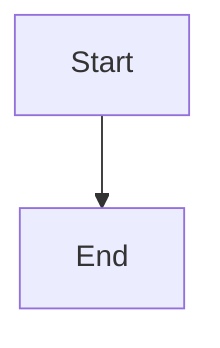

# Debugging Guide: Why Visuals Still Show as Code

## How to Check What's Happening

After deploying the latest update, you can now see detailed logs that show exactly where the rendering process is failing.

### Step 1: Access Railway Logs

1. Go to [Railway.app](https://railway.app)
2. Open your project
3. Click on your service
4. Click **"View Logs"** or **"Deployments"** → Latest deployment → **"View Logs"**

### Step 2: Upload a Test File

Upload a markdown file with mermaid diagrams through your web interface

### Step 3: Look for These Key Log Messages

#### **A. Mermaid Block Detection**
```
Found X mermaid blocks in fixed content
Found X mermaid blocks to render
```
- If this shows `0`, mermaid blocks aren't being detected
- Check if your mermaid blocks are properly formatted: ` ```mermaid`

#### **B. Browser Availability**
```
Browser available: True
```
or
```
Browser available: False
⚠️ Browser not available - using fallback rendering
```
- If `False`, Playwright/Chromium isn't installed
- This means diagrams will be placeholders, not actual rendered diagrams

#### **C. Image Creation**
```
[Diagram 1]
  ✓ Image created: XXXXX bytes
  ✓ Replaced block with image reference
```
- This confirms each diagram was rendered and replaced
- If you see `✗ Failed to create image file`, rendering failed

#### **D. Image Embedding**
```
Found X image references in markdown
✓ Embedded image: mermaid_diagram_1.png
```
- This confirms images are being converted to base64 and embedded in HTML
- If you see `✗ Image not found`, the path resolution is wrong

#### **E. Final Check**
```
Mermaid blocks in final content: 0
```
- Should be `0` - if not, blocks weren't replaced

## Common Issues and Solutions

### Issue 1: Browser Not Available

**Symptom:**
```
Browser available: False
```

**Cause:** Playwright/Chromium not installed in production environment

**Solution for Railway:**

1. Make sure your `Dockerfile` includes:
```dockerfile
# Install Playwright and Chromium
RUN pip install playwright && \
    playwright install --with-deps chromium
```

2. Or in your Railway settings, add a build command:
```bash
pip install -r requirements.txt && playwright install chromium
```

3. Check if `Dockerfile` is being used (Railway should auto-detect it)

### Issue 2: Mermaid Blocks Not Detected

**Symptom:**
```
Found 0 mermaid blocks in fixed content
```

**Cause:** Mermaid blocks not properly tagged

**Solution:**
- Ensure blocks are tagged as ` ```mermaid` (not ` ```diagram`, ` ```chart`, etc.)
- The updated code now also detects untagged blocks that start with mermaid keywords

**Example of correct format:**
````markdown

````

### Issue 3: Images Not Being Embedded

**Symptom:**
```
✗ Image not found: /path/to/image.png
```

**Cause:** Image path resolution issue

**Solution:** 
- Latest update embeds images as base64 data URIs
- This should work even if file paths are wrong
- Check logs to see if "✓ Embedded image" appears

### Issue 4: Still Seeing Code Blocks

**Symptom:**
```
⚠️ WARNING: Found X unprocessed mermaid blocks in markdown!
```

**Cause:** Mermaid renderer isn't replacing blocks

**Solution:**
Check the detailed logs for:
```
Total replacements made: X/Y
```
- If `X < Y`, some blocks couldn't be found/replaced
- Look for: `✗ ERROR: Could not find block in content to replace!`

## Testing Locally (If Possible)

If you can run Python locally:

```powershell
# Install dependencies
pip install markdown weasyprint pillow playwright

# Install Chromium
playwright install chromium

# Run the app
python app.py

# Open http://localhost:5000 and test
```

Watch the console output - you'll see all the debug messages

## What the Latest Update Does

1. **Base64 Embedding**: Images are now embedded directly in the HTML as data URIs, eliminating file path issues

2. **Comprehensive Logging**: Every step now logs what it's doing:
   - How many mermaid blocks found
   - Whether browser is available
   - Each diagram rendering status
   - Image embedding status
   - Final mermaid block count

3. **Better Detection**: Now detects untagged mermaid blocks (e.g., code blocks without language that start with `graph`, `flowchart`, etc.)

4. **Fallback Images**: If Playwright isn't available, creates placeholder images with PIL/Pillow

## Next Steps Based on Logs

### If logs show "Browser available: False"
→ **Fix Playwright installation in Railway**

Check your Dockerfile or add build command:
```bash
playwright install --with-deps chromium
```

### If logs show "Found 0 mermaid blocks"
→ **Check your input markdown format**

Make sure blocks are tagged properly with ` ```mermaid`

### If logs show "Image created" but "Image not found" when embedding
→ **Path issue (should be fixed with base64)**

The latest update should fix this - images are embedded as data URIs

### If logs show "Mermaid blocks in final content: X" (where X > 0)
→ **Replacement is failing**

Check for the detailed error message about which block couldn't be replaced

## Quick Diagnostic Checklist

After deploying, upload a test file and check logs for:

- [ ] `Found X mermaid blocks` (X > 0)
- [ ] `Browser available: True` (or at least False with fallback working)
- [ ] `✓ Image created` for each diagram
- [ ] `✓ Embedded image` for each diagram
- [ ] `Mermaid blocks in final content: 0`
- [ ] No `⚠️ WARNING` messages
- [ ] No `✗ ERROR` messages

## Still Not Working?

If after checking all the above, diagrams still show as code:

1. **Copy the full log output** from Railway
2. Look for the specific error messages
3. Check which step is failing
4. The logs will now show exactly where the process breaks

The enhanced debugging will tell us exactly what's going wrong!
