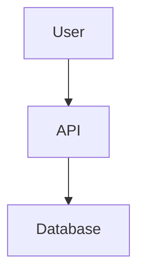

# Markdown to PDF Converter 📄

A web application that processes markdown files containing LLM research outputs, fixes rendering issues, and converts them to professional PDFs with all visuals rendered.

[](https://railway.app/new)

## ✨ Features

- 🔧 **Auto-Fix Syntax** - Automatically detects and corrects markdown and Mermaid syntax issues
- 🎨 **Render Visuals** - Converts Mermaid diagrams (flowcharts, sequence diagrams, etc.) to images
- 📄 **Professional PDFs** - Generates clean, well-formatted PDFs with no raw code
- 🌐 **Web Interface** - Beautiful, responsive UI accessible from any browser
- 🚀 **No Installation** - Deploy once, share with your team via link
- 📦 **Batch Processing** - Process single files or entire directories via CLI
- 🎯 **Smart Detection** - Automatically identifies Mermaid diagrams even without proper language tags

## 🎯 Perfect For

- Converting LLM research outputs to presentation-ready PDFs
- Sharing technical documentation with rendered diagrams
- Creating reports from markdown files with complex visualizations

## 🚀 Quick Start (Local)

### Prerequisites
- Python 3.8+
- Git

### Installation

```powershell
# Clone the repository
git clone https://github.com/YOUR-USERNAME/md-pdf-converter.git
cd md-pdf-converter

# Install dependencies
pip install -r requirements.txt
playwright install chromium

# Run the web application
python app.py
```

Open your browser to: **http://localhost:5000**

## 🌐 Deploy for Your Team (Share via Link!)

### Railway (Recommended - Easiest)

1. Push this repo to GitHub
2. Go to [Railway.app](https://railway.app)
3. Click "Deploy from GitHub repo"
4. Select your repository
5. Get your public URL in ~5 minutes!

**[📖 Full Railway Deployment Guide](RAILWAY_DEPLOY.md)**

### Other Deployment Options

- **Render** - Free tier available → [Guide](DEPLOYMENT.md#option-2-render)
- **Fly.io** - Excellent performance → [Guide](DEPLOYMENT.md#option-3-flyio)
- **DigitalOcean** - $5/month → [Guide](DEPLOYMENT.md#option-4-digitalocean)
- **Docker** - Self-hosted → [Guide](DEPLOYMENT.md#option-5-docker)

**[📖 Complete Deployment Guide](DEPLOYMENT.md)**

## 📖 Usage

### Web Interface (Recommended)

1. Visit the deployed URL or http://localhost:5000
2. Drag & drop or select a `.md` file
3. Click "Convert to PDF"
4. PDF automatically downloads with all visuals rendered!

**[📖 Web UI Guide](WEB_UI_GUIDE.md)**

### Command Line Interface

```powershell
# Process a single file
python main.py research_output.md

# Process with custom output name
python main.py research_output.md -o report.pdf

# Process entire directory
python main.py -d ./research_files -o ./pdfs

# Verbose mode
python main.py research.md -v
```

## 🎨 Supported Features

### Markdown Elements
- Headings, paragraphs, lists
- Tables with formatting
- Code blocks (Python, JavaScript, etc.)
- Blockquotes and links
- Images

### Mermaid Diagrams
- Flowcharts & graphs
- Sequence diagrams
- Class diagrams
- State diagrams
- ER diagrams
- Gantt charts
- Pie charts
- And more!

## 📁 Project Structure

```
md-research-processor/
├── app.py                 # Flask web application
├── main.py               # CLI interface
├── markdown_fixer.py     # Syntax fixing logic
├── mermaid_renderer.py   # Diagram rendering
├── pdf_converter.py      # PDF generation
├── templates/            # HTML templates
│   └── index.html
├── static/               # CSS and JavaScript
│   ├── style.css
│   └── script.js
├── Dockerfile            # Container configuration
├── requirements.txt      # Python dependencies
└── example_input.md      # Sample file
```

## 🐳 Docker

### Build and Run

```powershell
# Build
docker build -t md-pdf-converter .

# Run
docker run -p 5000:5000 md-pdf-converter

# Or use docker-compose
docker-compose up
```

Access at: http://localhost:5000

## 🔧 Configuration

### Environment Variables

- `FLASK_ENV` - Set to `production` for deployment (default: `development`)
- `PORT` - Server port (default: `5000`)

### File Limits

- Maximum file size: 16MB
- Supported formats: `.md`, `.markdown`, `.txt`
- Automatic cleanup of files older than 1 hour

## 📝 Example

Input markdown:
````markdown
# System Architecture


````

Output PDF:
- Rendered flowchart image
- No raw Mermaid code
- Professional formatting

## 🆘 Troubleshooting

### Local Installation Issues

- **WeasyPrint**: Install GTK3 from https://github.com/tschoonj/GTK-for-Windows-Runtime-Environment-Installer/releases
- **Playwright Browser Not Found

**: Run `playwright install chromium`
- **Import Errors**: Run `pip install -r requirements.txt`

### Deployment Issues
- See [DEPLOYMENT.md](DEPLOYMENT.md) for platform-specific troubleshooting
- Check logs in your deployment platform dashboard

## 🤝 Contributing

Contributions welcome! Areas for improvement:

- Additional diagram format support
- Custom PDF styling options
- Authentication system
- Batch processing UI
- API documentation

## 🎉 Share with Your Team

Once deployed, simply share the URL:

> 🔗 **Markdown to PDF Converter**: https://your-app.up.railway.app
>
> Upload markdown files, get professional PDFs with rendered diagrams!
> 
> ✅ No installation needed
> ✅ Works in any browser
> ✅ Automatic diagram rendering

**Perfect for LLM research outputs, technical docs, and reports!** 🚀

## 📚 Documentation

- **[DETAILED_DEPLOYMENT.md](DETAILED_DEPLOYMENT.md)** - 📖 **START HERE!** Complete step-by-step deployment guide
- **[RAILWAY_DEPLOY.md](RAILWAY_DEPLOY.md)** - Quick Railway deployment (5 minutes!)
- **[DEPLOYMENT.md](DEPLOYMENT.md)** - Overview of all deployment options
- **[WEB_UI_GUIDE.md](WEB_UI_GUIDE.md)** - Using the web interface
- **[INSTALL.md](INSTALL.md)** - Local installation guide

## 📄 License

MIT License - Feel free to use for personal or commercial projects

---

Made with ❤️ for better technical documentation

## Contributing

Contributions are welcome! Areas for improvement:
- Additional diagram format support
- Better error handling for complex Mermaid syntax
- Alternative rendering backends
- Custom PDF styling options
