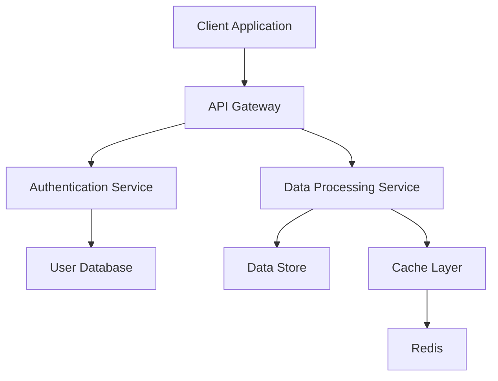
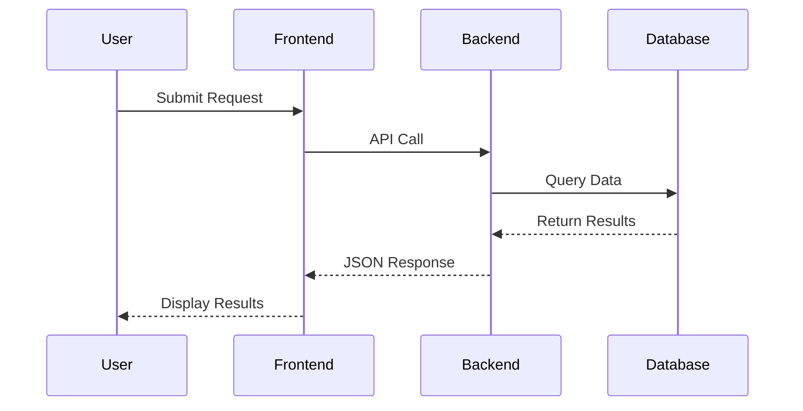
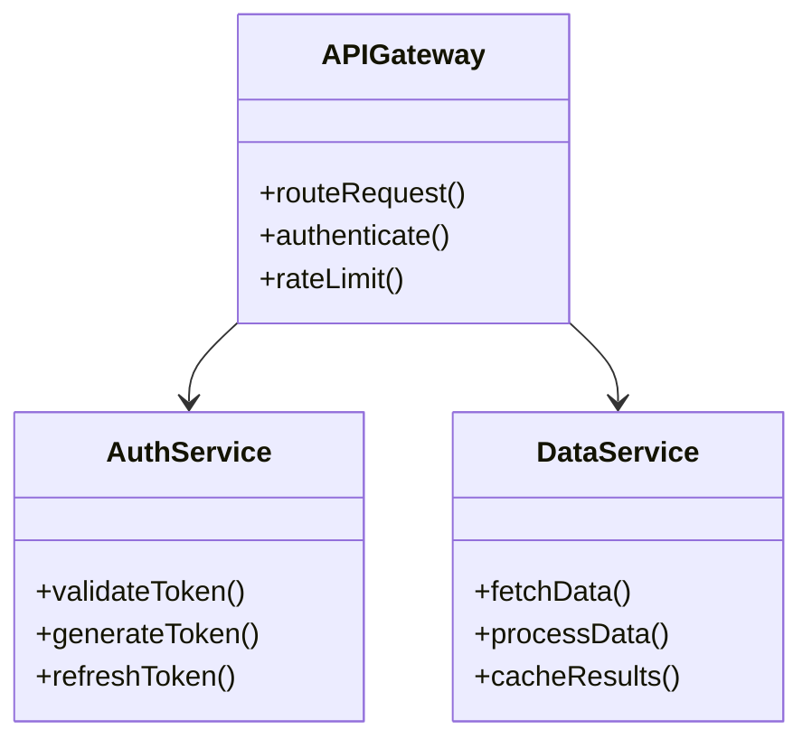
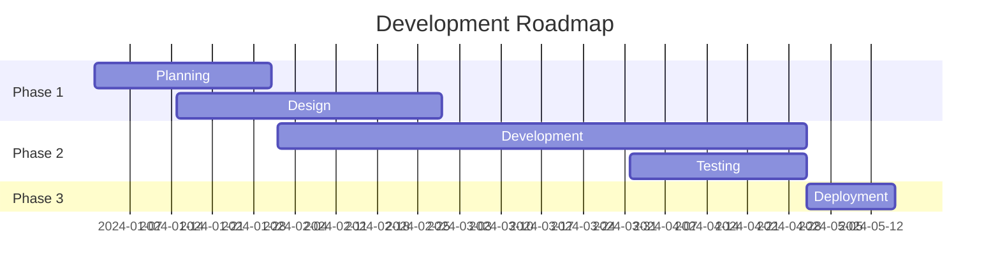
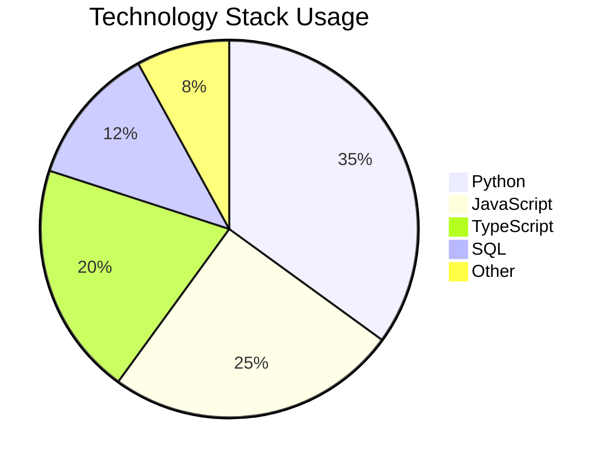
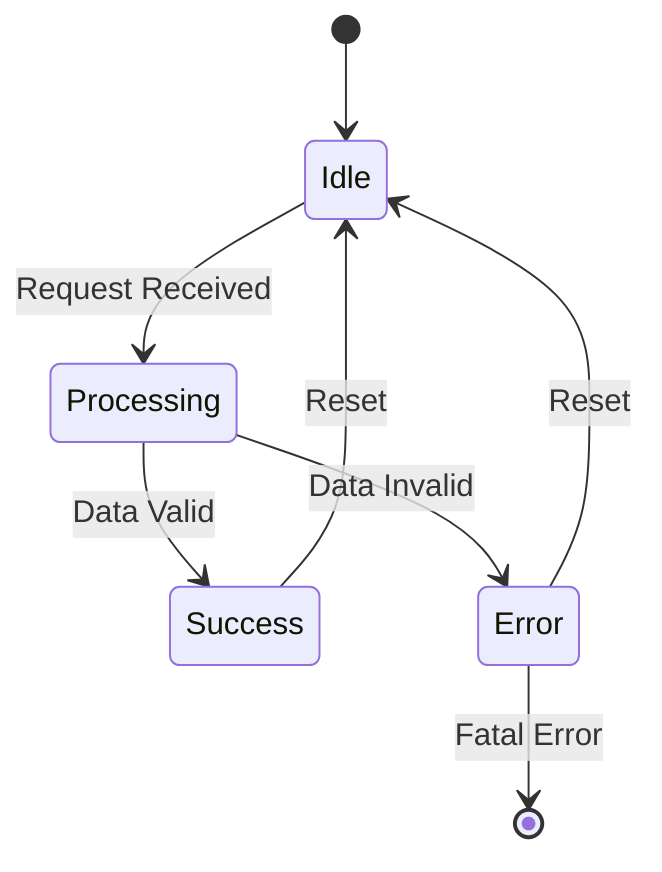

# LLM Research Output Example

## Executive Summary

This document contains research findings from various LLMs about system architecture and data flow patterns.

## System Architecture Overview

The following diagram shows the high-level architecture:



## Data Flow Analysis

### Request Processing Pipeline

Here's how requests flow through the system:



## Component Relationships

The class structure is organized as follows:



## Project Timeline



## Technology Distribution



## Code Example

Here's a Python implementation of the data processor:

```python
class DataProcessor:
    def __init__(self, config):
        self.config = config
        self.cache = {}
    
    def process_request(self, data):
        # Check cache first
        cache_key = self.generate_key(data)
        if cache_key in self.cache:
            return self.cache[cache_key]
        
        # Process data
        result = self.transform_data(data)
        
        # Cache result
        self.cache[cache_key] = result
        return result
    
    def transform_data(self, data):
        # Transformation logic here
        return {"processed": data, "timestamp": datetime.now()}
```

## Results Summary

| Metric | Value | Status |
|--------|-------|--------|
| Performance | 95% | ✓ Excellent |
| Reliability | 99.9% | ✓ Excellent |
| Scalability | 1000 req/s | ✓ Good |
| Cost | $500/mo | ✓ Acceptable |

## State Management

The application state transitions are modeled below:



## Conclusion

The system demonstrates robust architecture with clear separation of concerns and efficient data flow patterns. All components are well-integrated and scalable.

## Next Steps

1. Implement additional caching layers
2. Enhance monitoring and alerting
3. Optimize database queries
4. Scale horizontally for increased load
